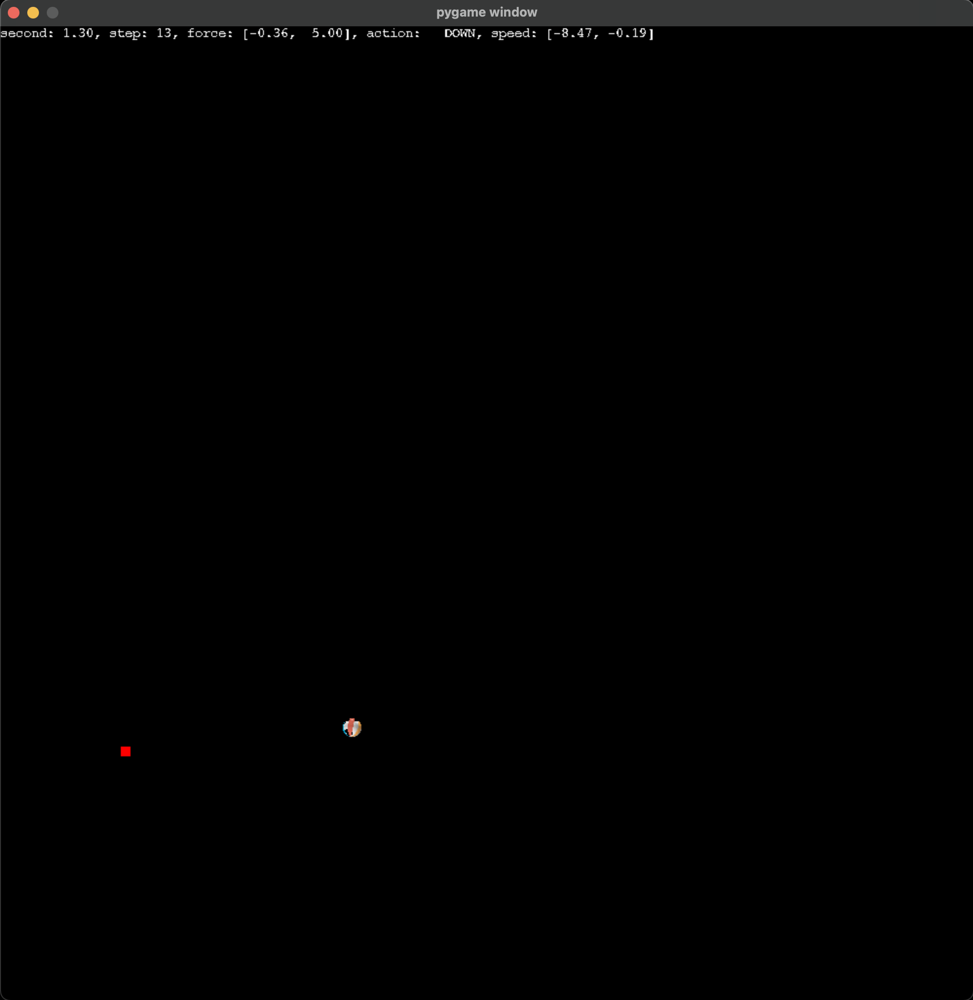
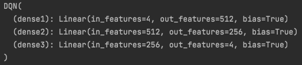
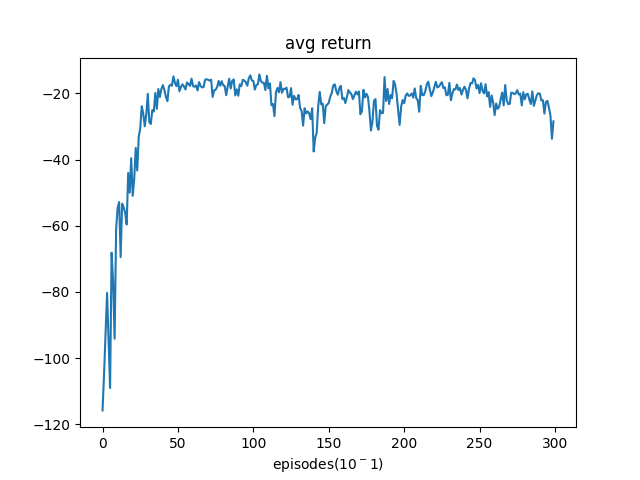
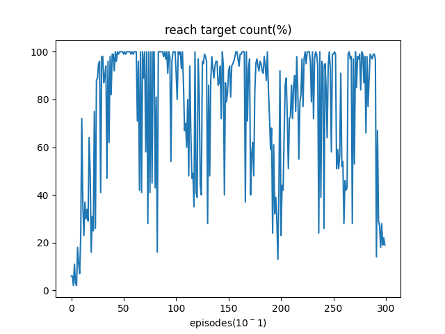
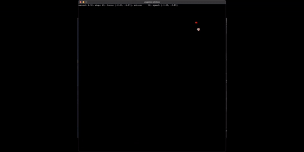

# 冰壶游戏

## 问题描述

​		冰壶游戏是要控制一个半径为1，质量为1的冰壶，在一个长宽是100×100的正方形球场内移动。不考虑冰壶的自转。当冰壶和球场的边界碰撞时，碰撞前后冰壶的速度会乘上回弹系数0.9，移动方向和边界呈反射关系.我们需要分别操纵x轴和y轴的两个力控制冰壶的移动:在x轴的正或反方向施加5单位的力;在y轴的正或反方向施加5单位的力.这样一共会有4种不同的控制动作.动作可以每1/10秒变换一次;但在仿真冰壶运动动力学时，仿真时间间隔是1/100秒.除了我们施加的控制动作，冰壶会受到空气阻力，大小等于0.005×speed2.假设冰壶和地面没有摩擦力.在每个决策时刻(1/10秒)，环境反馈的奖励等于−d，其中d是冰壶和任意给定的目标点之间的距离.为了保证学到的策略能够控制冰壶从任意初始位置上移动到任意目标点，每隔30秒就把冰壶状态重置到球场内的一个随机点上，同时x轴和y轴的速度也随机重置在[-10，10]范围内.与此同时，目标点也被随机重置.

## 方案及思路

由于在该问题中，我们的状态是一个连续空间，包括（冰壶的坐标，目标点的坐标，物体当前的速度）等，Q-learning的表格法只能表示离散的状态，而若将状态离散化，存在精度下降，以及收敛速度慢的问题。于是，我将使用DQN的方法，即Deep Q Network。神经网络的输入为状态特征，而输出即为每个动作对应的Q值（最优状态-动作价值），神经网络擅长处理连续变化的状态。而在本问题中，动作是有限的（仅有4个），所以输出4个对应的Q值即可。

实现参考自pytorch官方教程：https://pytorch.org/tutorials/intermediate/reinforcement_q_learning.html

## 环境搭建

本问题中，需要模拟冰壶在场地内的动力学，以下是模拟时需要注意的问题：

- 题目要求仿真的间隔为0.01秒。在0.01秒以内，假设速度不会发生变化，更新物体的位置。
- 每隔0.01秒，根据当前的物体的速度计算出的空气阻力，和智能体施加的力，更新速度值。
- 在0.01秒更新位置时，可能会将物体的一部分移出场地外部（即发生了碰撞），需要将物体位置按照镜面反射进行校正，并将物体的速度衰减为0.9倍，并且对应方向的速度进行取反。

使用pygame，将模拟的环境进行展示：



其中，红色的方块表示为目标位置，彩色的球代表冰壶，上方文字展示了当前的秒数，步数，球当前受力，速度，以及使用的动作。

## 训练方法

### 状态特征提取

需要关注的状态，包括冰壶的位置，目标点的位置，以及冰壶的速度。

通过比较了多种状态特征提取方案，最终发现选择以下四个状态最容易收敛，即：

- x轴上，冰壶到目标点的距离
- y轴上，冰壶到目标点的距离
- x轴上，冰壶的速度
- y轴上，冰壶的速度

```python
environment.py line 77:

return torch.tensor([
    self.relative_target_position_x/WIDTH,
    self.relative_target_position_y/HEIGHT,
    self.speed_x/self.max_speed,
    self.speed_y/self.max_speed
]).unsqueeze(0)
```

获得这四个状态量后，需要对他们进行预处理，归一化到$[0, 1)$，使得训练效率更高。需要计算出这些量的取值范围，对于相对距离，即可使用场地的宽度作为最大值。对于速度，由于初始速度在每个方向上最大为10，通过计算，速度最快能够达到38.5，所以将速度除以该值即可。

### DQN网络

由于状态特征仅有4维，问题复杂程度不高，搭建一个简单的两层全连接网络即可。

以下为网络的summary，第一层512，第二层256，最后输出动作的个数，即为4个。



### 记忆重放

在DQN训练方法中，非常重要的一点即为需要将过往的动作经验进行记忆，在其中进行采样来训练网络。这其中的原因即为，若连续使用每个动作产生的及时奖励，会将时间的连续性涵盖到网络中，不利于网络泛化到任意场景。所以，需要将过去的状态，动作，产生的奖励和下一个状态记忆下来，放入到一个ReplayMemory中。

```python
agent.py line 25

class ReplayMemory(object):
    def __init__(self, capacity):
        self.memory = deque([], maxlen=capacity)

    def push(self, *args):
        self.memory.append(MemoryFormat(*args))

    def sample(self, batch_size):
        return random.sample(self.memory, batch_size)

    def __len__(self):
        return len(self.memory)
```

每当进行训练时，从该Memory中随机地采样BatchSize个样本，每个样本的信息格式如下：

```python
MemoryFormat = namedtuple('ReplayMemory',
                          ('state', 'action', 'next_state', 'reward'))
```

即包含了当前的状态，对当前状态采取的动作，该动作获得的即时奖励，以及下一个状态。


### loss计算以及梯度裁剪

loss的计算与标准的DQN方法一致，即获取当前的策略网络：policy_net获得对于该状态产生的Q值，并选择记忆中的动作对应的Q值（4行），随后使用target_net（即目标网络，与policy_net结构一致，但是使用的权重是数个step之前的，每隔数个step后，将policy_net的权重同步到target_net中。使用这种方法，policy_net更容易收敛）。

损失函数采取了Huber Loss，它类似于均方误差，但是在误差较大时会采取降级，使得最终loss比较平缓。

最后，在梯度下降时，进行了裁剪，使得每个梯度在$[-1, 1]$的范围之内，避免梯度过大使得网络不稳定的情况。

```python
agent.py line 84

# 获取当前policy网络的动作对应的Q值
net_out = self.policy_net(state_batch)
state_action_values = net_out.gather(1, action_batch)

next_state_values = torch.zeros(BATCH_SIZE)
next_state_values[non_final_mask] = self.target_net(non_final_next_states).max(1)[0].detach()
# 获取target网络对下一状态的Q值估计最大的值，使用它乘以GAMMA，再加上即时Reward作为单步回报的估计值
expected_state_action_values = (next_state_values * GAMMA) + reward_batch

# 使用Huber损失函数，获得更稳定和平滑的loss
criterion = nn.SmoothL1Loss()
loss = criterion(state_action_values, expected_state_action_values.unsqueeze(1))

# 进行一步训练
self.optimizer.zero_grad()
loss.backward()
for param in self.policy_net.parameters():
    # 裁剪梯度，防止梯度爆炸或不稳定。
    param.grad.data.clamp_(-1, 1)
self.optimizer.step()
```

### 训练流程

训练流程：不断地进行游戏，使用$epsilon-greedy$策略，在初期，有较高的机会进行探索，而在后期，仅给予5%的探索概率，95%的情况下使用policy_net提供的动作。通过不断的进行游戏，获取数据，拟合policy_net。

```python
main.py:

def train():
		# ... 初始化
    # 一共进行num_episodes局游戏
    for i_episode in range(num_episodes):
      	# 每局游戏开始时，重置环境
        state = agent.env.reset()
        if i_episode % eval_episodes == 0:
          	# ...
            # 进行evaluation，并记录下更好的模型的checkpoint
        for t in count():
          	# 1. 根据状态，选择一个动作
            action = agent.select_action(state)
            total_step += 1
            # 2. 环境根据动作，获取即时奖励和下一个动作
            next_state, reward, done, reach_target = agent.env.step(action.item())
            reward = torch.tensor([reward])

            if done:
                next_state = None
						# 3. 加入记忆回放
            agent.memory.push(state, action, next_state, reward)

            # 4. 更新状态
            state = next_state
            
            # 5. 优化一步模型
            agent.optimize_model()
            if done:
                break
        if i_episode % TARGET_UPDATE == 0:
            agent.copy_weights_to_target_net()
    show_avg_return_fig(avg_returns=his_avg_return)
    show_reach_targets(reach_targets=his_reach_target)
```


### 训练效果

下图为每隔10局游戏，验证100局游戏内的平均回报值曲线，在50局游戏以后稳定在-20左右，约在150局以后出现过拟合，产生下降：



下图为每隔10局游戏，验证100局游戏内的终点到达率，在50局游戏以后能够达到100%，但在之后训练过多会产生剧烈震荡，在100局以后，难以维持100%：




### 演示效果GIF

